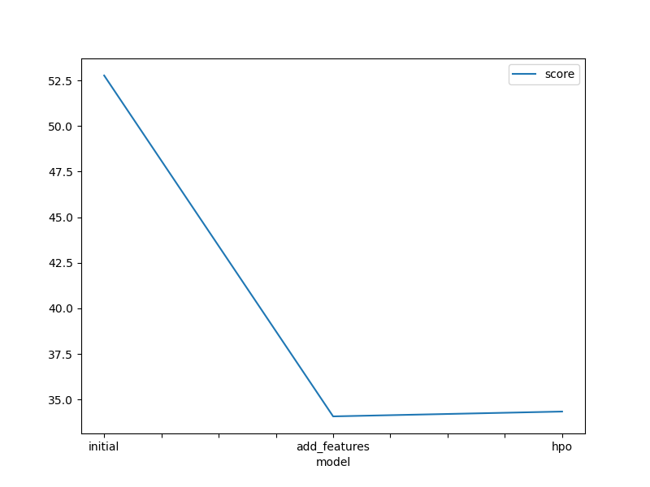
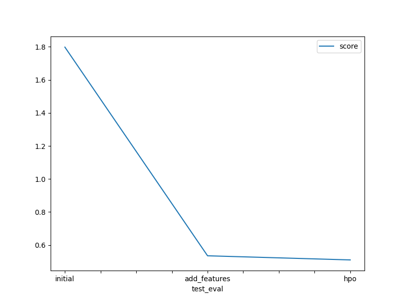

# Report: Predict Bike Sharing Demand with AutoGluon Solution
#### Anil Gurugubelli

## Initial Training
### What did you realize when you tried to submit your predictions? What changes were needed to the output of the predictor to submit your results?
At initial model, when submit my predictions even i dont have negative values the score 1.79 is acheived which is not consder well. so, i realized to perform data preprocessing EDA like converting 'datetime' and dropping uncorrelated features and got new score 0.54.

### What was the top ranked model that performed?
WeightedEnsemble_L2 is performed as top ranked model with score 0.51

## Exploratory data analysis and feature creation
### What did the exploratory analysis find and how did you add additional features?
There is high correlation between 'casual' and 'registered' so these are ignorable features. 'datetime' itself not providing information so splitted it into year,day,month,hour added as additional features and transforming 'season', 'weather' to categorical datatype.

### How much better did your model preform after adding additional features and why do you think that is?
The score of the model comes down to 0.54 from 1.79 because, the feature engineering and data preprocessing steps make able to learn the hidden patterns to predict the outcome.

## Hyper parameter tuning
### How much better did your model preform after trying different hyper parameters?
There is a little improvement in the score from 0.54 to 0.51 by trying hyper parameters.

### If you were given more time with this dataset, where do you think you would spend more time?
If i was given more time with this dataset, I spen more time on feature engineering and adding Additionl features and dropping and some other features and performing different hyper parameter tunning.

### Create a table with the models you ran, the hyperparameters modified, and the kaggle score.
|model|hpo1|hpo2|hpo3|score|
|--|--|--|--|--|
|initial|prescribed_values|prescribed_values|presets: 'high quality'|1.798|
|add_features|prescribed_values|prescribed_values|presets: 'high quality'|0.535|
|hpo|Tree-Based Models|KNN|presets: 'optimize_for_deployment|0.510|

### Create a line plot showing the top model score for the three (or more) training runs during the project.

### Create a line plot showing the top kaggle score for the three (or more) prediction submissions during the project.

## Summary
Studied and incorporated  AutoGluon AutoML framework for Tabular Data for bike sharing demand prediction project. The improvement of model score observed through performing EDA and Hyper parameter tunning. In this overall project, I gained lot of knowledge through implementation by solving errors.
